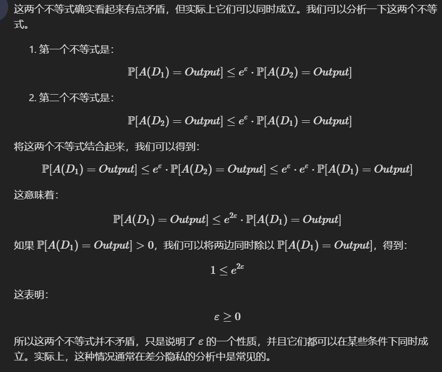
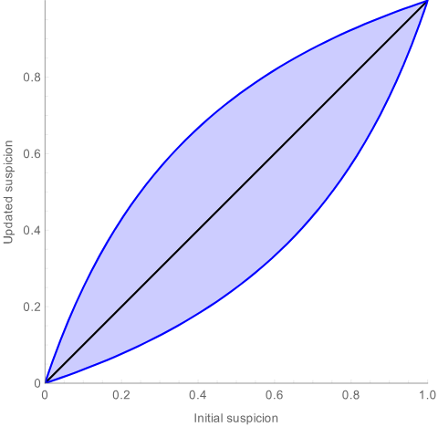
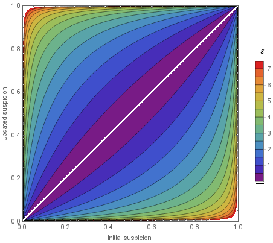

# 差分隐私友好介绍阅读笔记

原文：[A friendly, non-technical introduction to differential privacy - Ted is writing things](https://desfontain.es/blog/friendly-intro-to-differential-privacy.html)  

差分隐私（Differential Privacy）已经备受瞩目，公司和政府都开始发布利用差分隐私方法处理后的数据，统计学家们也开始逐渐习惯于用这种新方法来保护数据。
# 1. 为什么差分隐私很棒

* 原文：[Why differential privacy is awesome - Ted is writing things](https://desfontain.es/blog/differential-privacy-awesomeness.html)  

“在发布和人相关的数据时，怎么同时保护他们的隐私？” 这是一个已经被抛出了很久的问题。前人提出的很多方法都有局限性，很难实际应用且容易破坏**数据效用（可用）性**（**Utility of the data**），即数据没法在实际场景中用。  

## 1.1. 差分隐私的核心思路

假设有一个流程，以一些数据（集）作为输入，并能返回一些输出结果：  

$$
datasets \rightarrow \fbox{Some Process} \rightarrow outputs
$$

中间这个流程可以是：  

1. 计算数据的统计数据。
2. 脱敏策略。
3. **机器学习训练过程**。  
4. ...

为了让这个流程在差分的层面是隐私安全的，需要对其进行修改，比如**加上一些随机扰动、噪声**。

* 对于不同的流程，可能需要设计不同的扰动模式。  

💡 在进行处理后，如果从数据集中**移除某个个体的数据后再执行同样的流程**，且其输出结果和没有移除该个体的数据集的处理结果 ❗ **基本上一致**，那么其就满足差分隐私。（无论移除的是哪个个体，也无论是什么数据集）  

* 先把这个处理过程定义为一个神奇的过程 $Magic$ ：

$$
\begin{matrix}
\fbox{A,B,C,D,E} & \rightarrow & \fbox{Magic} & \rightarrow & Outputs \\
Datasets & & & & \uparrow \\
& & & & 基本一致 \\
Datasets' & & & & \downarrow \\
\fbox{A,B,C,\ ,E} & \rightarrow & \fbox{Magic} & \rightarrow & Outputs' 
\end{matrix}
$$

💡 所谓的“**基本一致**”指的是经过相同的流程 $Magic$ ，在两个数据集上的输出**有类似的 ❗ 概率分布**情况。  

---

应用：这种时候如果有人想通过输出判断一个个体是否在原数据中（MIA）就很难了，一个输出可能来自存在这个个体数据的数据集 $Datasets$ ，也可能来自不包含这个个体数据的数据集 $Datasets'$ ，有没有这个个体，输出的概率都是类似的，因此难以判断。    

---

❗ 差分隐私**是处理流程的一部分**，而不是输入数据集和输出的。  

## 1.2. 差分隐私咋就那么特别咧

### 1.2.1. 不再需要建立攻击模型（Attack modeling）  

以前很多隐私保护方法都需要关于攻击者能力和行为的一些假设以实行防御思路，但实际上这是很难施行的，攻击者稍微绕绕弯，防御方法就打水漂了。

而差分隐私确保：  

1. 可以保护**任何个体**的**各种信息**。无关攻击者的目的。
2. 防御**无关攻击者的先验知识**，只要是攻击者未曾掌握的数据都能被保护。  

### 1.2.2. 可以量化隐私损失（Privacy loss）

DP 有明显的隐私损失（Privacy loss），记为 $\epsilon$ ，量化了攻击者通过分析数据或查询结果，能够推断出个体信息的**可能性**。 

### 1.2.3. 可以量化组合数据的风险

分别以参数 $\epsilon$ 向 Alex 和 Brinn 提供差分隐私保护的数据，即使他们**私下勾结**，合并后的数据仍然受到差分隐私的保护，只是隐私参数变为 $2\epsilon$，风险是可量化的，隐私保护作用依然在。  

而像 K-匿名性保护方式可能就会不再有效。  

### 1.2.4. 核心利用点

**操作数据的流程中的不确定性**越多就能使得**攻击者面临的不确定性越多**，攻击也就越难，隐私保护也就越好。  

# 2. 更详细地了解差分隐私

* 原文：[Differential privacy in (a bit) more detail - Ted is writing things](https://desfontain.es/blog/differential-privacy-in-more-detail.html) 

## 2.1. ❗ 定义

如果数据在经过某个流程的处理后，即使改变数据中的一个个体，输出也是“**基本上一致**”的，这就满足了差分隐私。

* ❗ 基本上一致指的是**相应的概率一致**。

💡 如果数据集 $D_1$ 和 $D_2$ 只相差一个个体的数据（相邻数据集），在经过某个流程 $A$ 后若满足以下定义，则 $A$ 满足 $\varepsilon$ - 差分隐私：  

$$
\mathbb{P}[A(D_1)=Output] \le e^\varepsilon \cdot \mathbb{P}[A(D_2)=Output]
$$

* ❗ 而且**对于所有可能的输出 $Output$ 都要满足**这一公式。  
* 即左右两边概率**相差不超过（$\le$）$e^\varepsilon$ 倍**。
* 参数 $\varepsilon \gt 0$ ，$\varepsilon$ 越大，**二者概率就越差得远**。

💡 另外，既然是相邻数据集，那么在差分隐私的定义上应该**也是对称的**：  

$$
\begin{matrix}
\mathbb{P}[A(D_1)=Output] \le e^\varepsilon \cdot \mathbb{P}[A(D_2)=Output] \\
\mathbb{P}[A(D_2)=Output] \le e^\varepsilon \cdot \mathbb{P}[A(D_1)=Output]
\end{matrix}
$$

把上面这个式子稍微变一下形就成为了：  

$$
e^{-\varepsilon} \cdot \mathbb{P}[A(D_2)=Output] \le \mathbb{P}[A(D_1)=Output] \le e^\varepsilon \cdot \mathbb{P}[A(D_2)=Output]
$$

* 就算交换了 $D_1$ 和 $D_2$ 也成立。  
* 💡 也就是说我**修不修改这个个体，经过 $A$ 处理后的输出都是类似的，受 $\varepsilon$ 控制**。

❓ 这两个式子看上去其实有些矛盾，但其实是可以证明其可行性的，这里就让大模型来给出了：  

  

## 2.2. 简单的例子：有随机性的调查回复

假如要调查有多少人非法用药，如果直接凑别人面前问“你上周是否非法用药了”，别人很可能会撒谎，因为非法用药的人不想让调查者知道他们的犯罪行为。  

为了隐匿这些人的实际情况，引入这样的机制：  

1. 让每一个人都**独立投掷一枚硬币**。
2. 如果硬币是正面，受访人要回答**真实情况**（是/否非法用药）
3. 如果硬币是反面，那么就再投掷一次硬币，如果这枚硬币最终是正面则回答“**是**”，否则回答“**否**”。

这样一来受访者就可以安心接受调查了，**他们的回答不会透露他们是否真的犯罪了**，当一个人回答“是”时，**无法知道他是真的在犯罪，还是单单的硬币投掷结果**。  

从概率的角度来看一个**犯罪的人**：  

1. 每个**犯罪的人**有 50% 的可能性回答真实情况，即“是”。
2. 每个**犯罪的人**还有另外 50% 的可能性随机回答：
	* 有 50% 的情况会回答“是”，总的算下来是 $50\% \times 50\%=25\%$ 
	* 同理回答“否”在这里的可能是 $25\%$ 

总的看来一个犯罪的人有 $75\%$ 的可能性会回答“是”，仅有 $25\%$ 的可能性回答“否”。同理可知对于没有犯罪的人，他们的概率是反过来的，只有 $25\%$ 的概率回复“否”。  

设定上面这个机制为 $A$ ，则有：  

$$
\begin{matrix}
\mathbb{P}[A(Yes)=Yes]=0.75 & \mathbb{P}[A(Yes)=No]=0.25  \\
\mathbb{P}[A(No)=Yes]=0.25 & \mathbb{P}[A(No)=No]=0.75
\end{matrix}
$$

$\mathbb{P}[A(Yes)=Yes]=0.75$ 是 $\mathbb{P}[A(No)=Yes]=0.25$ 的**三倍**，因此可以选择 $e^\varepsilon = 3$ ，即 $\varepsilon \approx 1.1$ ，其满足 $\varepsilon$ - 差分隐私。  

---

很明显差分隐私往数据中**引入了随机噪声**，但如果有**足够多数据**的输出，噪声就很有可能会被抵消掉，从而能反映真实分布。  

* 假设上面的例子中共有 1000 次输出，有 400 次输出“是”，有 600 次输出“否”。1000 个输出中约有 50% 是随机的，因此可以去除掉一半（500），比如“是”和“否”输出各去掉 250（❗ 认为噪声是均匀分布的），分别剩余 150 和 350 次。
* 这种情况下“是”占的比例是 $\frac{150}{150+350}=0.3$ ，总体上“是”占 30% ，即估计其真实占比**约为** 30%  

通过调整参数 $\varepsilon$ 可以相应调整上面这些概率。  

## 2.3. 推广：量化攻击者的先验知识

咱们设立了一个满足 $\varepsilon$ - 差分隐私的处理机制 $A$ ，将其应用于一个数据集 $D$ ，并把 $A(D)$ 提供给攻击者。

> $A(D)$ 可以是数据聚合结果、机器学习模型的输出等...

从攻击者的角度来看，想知道**他们的目标是否在原数据集 $D$ 中出现了**。（即 MIA，成员推断攻击） 

* 在差分隐私下，攻击者即使有关于数据集的很多先验知识，也无法拿到很多他们的目标的相关信息。

假设一个攻击者**除了他们的目标外**，**知道已有的其他数据的信息**，他需要分辨出原数据集 $D$ 是 **所需的目标所在的数据集** $D_{in}$ ，还是**没有目标存在的数据集** $D_{out}$  。  

* 对于攻击者来说，原数据集 $D$ 可能是 $D_{in}$ 也可能是 $D_{out}$  。
* 如果**怀疑目标在 $D$ 中**，设其猜测概率为 $P[D=D_{in}]$ 
* 如果**怀疑目标不在 $D$ 中**，设其猜测概率为 $P[D=D_{out}]$
* 此处有 $P[D=D_{in}]=1-P[D=D_{out}]$ 
* 如果猜测概率是 $0.5$ ，说明攻击者**拿不准主意**。

攻击者在拿到经过 $A$ 的输出 $O$ 后，**怀疑目标在 $D$ 中的**的概率会变为：  

$$
P\left[D=D_{in}\mid A(D)=O \right] 
$$

因为 $A$ 满足差分隐私，$P\left[D=D_{in}\mid A(D)=O \right]$ 和 $P[D=D_{in}]$ 的差距不会很大，且**易于量化这种差距**（没错，还是 $\varepsilon$ 这个参数）  

比如在 $\varepsilon=1.1$ 的情况下，可视化后的上下界如下：  

  
> 黑线就是攻击者原本的猜测概率，蓝色的线则代表在获知 $A(D)$ 后的猜测概率上下界。  

* 注：原文有证明。  

  
> 可以看到 $\varepsilon$ 越大，攻击者就**越容易**从 $A(D)$ 推断出 $D$ 的一些实际情况。  

## 2.4. 组合两个差分隐私处理机制

如果有满足 $\varepsilon$ - 差分隐私的处理机制 $A$ 和 $B$ ，两个处理机制的**随机性是相互独立的**，假设有一个算法 $C$ 结合了 $A$ 和 $B$：  

$$
C(D)=(A(D),B(D))
$$

对应输出为一对 $O=(O_A,O_B)$ 

因此有：  

$$
\begin{align}
P[C(D_1)=O] &= P[A(D_1)=O_A] \cdot P[B(D_1)=O_B] \\
	& \le e^{2\varepsilon} \cdot P[A(D_2)=O_A] \cdot P[B(D_2)=O_B] \\
	& \le e^{2\varepsilon} P[C(D_2)=O]
\end{align}
$$

组合之后 $C$ 为**满足 $2\varepsilon$ - 差分隐私**的处理机制。  

