# 【小记】图片托管从又拍云迁移到腾讯云（兼容图片处理参数）

2026 年 9 月 4 日，我正写着半年总结的博文呢，突然发现托管在又拍云上的图片无法访问了，去 itdog 测了一下发现真的是又拍云的节点炸完了，之前从未遇到这种情况。

去又拍云联盟的用户群里问了一下，正好认识的博主 Ghost_chu 在那，他提醒我尽量把又拍云额度用完，企查查上又拍云已经是“限制高消费”状态。去 [L 站看了一下](https://linux.do/t/topic/2817601)，发现也有佬友反馈了又拍云问题无人处理的情况，看起来就像是要跑路的样子...明明年初我申请又拍云联盟还有人处理呢...十年前如日中天的又拍云，如今落得如此地步，真的令人唏嘘啊。  

  

话说回来，我博客图片还得迁移一下。正好腾讯云有免费的 EdgeOne 套餐，且也给了老用户长期免费的对象存储资源包，我决定迁移到腾讯云这边了。这篇小记就记录一下迁移过程中的小巧思吧。

## 1. 发现问题

虽然无法通过 URL 访问图片了，但好在 FTP 还是能登录上去的（支持 S3 协议的客户端应该也还能用），我火速把所有的图片都下载下来了，总共有 500+ MiB （这样看写博客这十年其实也没有用多少空间）。  

迁移到腾讯云对象存储桶是很简单的事。然鹅，我很快就发现了一个问题，我在博文中**大量使用了又拍云的图片处理功能**，即 URL 末尾有类似 `!/scale/50` 这样的参数，而迁移到腾讯云这边是没有办法直接使用的。我希望能保持所有现存图片 URL 不变的情况下进行迁移。

## 2. 分析问题

为了确认该问题的影响面积，我拉取了博客仓库并利用了 Pi Agent 编写脚本对我博客的所有博文进行扫描:  

```text
目前你正处在我的博客仓库下，博文都写在 .html 文件中。  

我在博文中大量使用了又拍云的图片处理功能，即图片 URL 末尾有类似 `!/scale/50` 这样的参数，同时我也可能不止使用了 `scale`，还有 `rotate`, `flip` 等处理，可能也有 `!/scale/50/rotate/90` 这样的组合。  

请你编写 Python 脚本对所有博文进行扫描，统计这种参数出现的次数，影响的博文面积。同时也统计 `scale`、`rotate` 等参数各自的出现次数。 

**不要修改任何仓库内容**，统计后输出结果即可。  
```

<details>

<summary>Agent 排查结果</summary>

### 总览

| 指标 | 数值 |
|---|---|
| HTML 文件总数 | 310 |
| 其中博文文件（`post-*.html` / `bottle-*.html`） | 287 篇 |
| 含参数 URL（`!` 链） | 400 条 |
| 操作实例总数 | 406 处 |
| 受影响 HTML 文件 | 31 个 / 310 个（10.0%） |
| 受影响博文 | 30 篇 / 287 篇（10.5%） |
| 受影响图片 URL | 400 次引用，去重后 400 个 |

### 各操作出现次数与取值分布

| 操作 | 次数 | 取值分布 |
|---|---|---|
| `scale` | 397 | 30×172, 40×120, 20×36, 60×26, 50×20, 10×6, 70×6, 35×5, 80×3, 41×1, 25×1, 15×1 |
| `rotate` | 9 | 270×4, 90×4, auto×1 |
| 其它（flip 等） | 0 | — |

### 链形态分布（共 19 种）

| 形态 | 条数 |
|---|---|
| `!/scale/30` | 170 |
| `!/scale/40` | 119 |
| `!/scale/20` | 34 |
| `!/scale/60` | 26 |
| `!/scale/50` | 19 |
| `!/scale/10` | 6 |
| `!/scale/70` | 6 |
| `!/scale/35` | 5 |
| `!/scale/80` | 3 |
| `!/scale/20/rotate/270` | 2 |
| `!/rotate/90` | 2 |
| `!/scale/41` | 1 |
| `!/scale/25` | 1 |
| `!/rotate/auto` | 1 |
| `!/rotate/90/scale/40` | 1 |
| `!/rotate/90/scale/50` | 1 |
| `!/rotate/270/scale/30` | 1 |
| `!/scale/30/rotate/270` | 1 |
| `!/scale/15` | 1 |

即 400 条链中：391 条只缩放，3 条只旋转，6 条为组合写法（`rotate→scale` 与 `scale→rotate` 各 3 条）。

</details>

---

腾讯云这边对象存储集成了数据万象 (CI) 服务，是[支持通过 ImageMogr2](https://cloud.tencent.com/document/product/460/36540) 来处理图片的，好消息是它支持类似又拍云的组合式图片变换，但坏消息是它的 URL 参数模式与又拍云的不一样。不过咱发现 EdgeOne 这边也有边缘函数的免费额度，我完全可以**利用边缘函数做一个兼容层**，把又拍云的 URL 参数转换为腾讯云 COS 数据万象支持的 ImageMogr2 参数，这样看上去就可以完美解决了。  

但是！事情并没有这么简单，从 [EO 套餐的说明文档](https://cloud.tencent.com/document/product/1552/94165)可以看到边缘请求数和 CPU 耗时都有限制:  

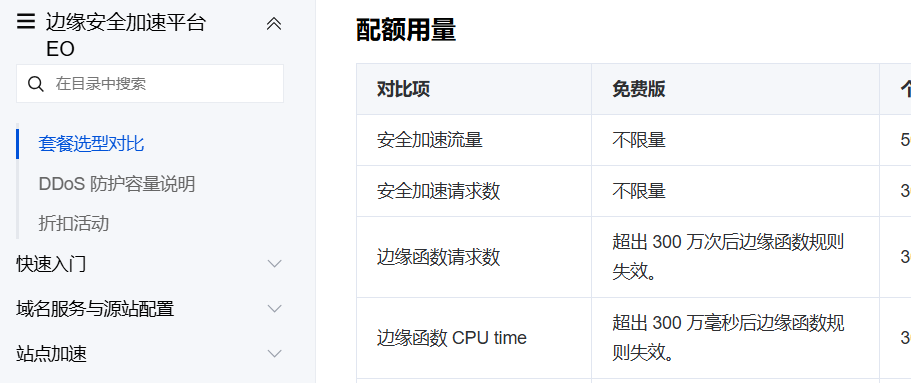  

更糟的是，根据 EO 的请求处理顺序说明（见文档：[请求处理顺序](https://cloud.tencent.com/document/product/1552/84772)、[边缘函数概述](https://cloud.tencent.com/document/product/1552/81344)），边缘函数执行时是**在查询节点缓存之前**的。也就是说，如果我直接用边缘函数去做转换，那么**每次访问带处理参数的图片 URL 时都会耗费掉边缘函数执行额度**，这一部分无法利用 EdgeOne 缓存！  

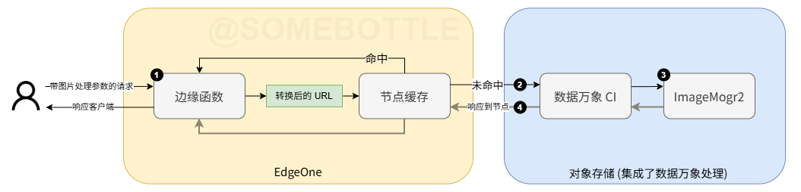  

有四部分可能产生费用或被限制:  

1. 边缘函数（每次请求都会执行，消耗免费额度，消耗完了就无法处理图片了）；
2. COS 请求费用（缓存未命中时。老用户有每个月的免费额度）；
3. 数据万象图像处理费用（缓存未命中时。按原图文件体积计费，每个月免费 10 TiB）；
4. 数据万象 CDN 回源流量费用，按处理后图像体积计费。没错，这个是要额外算的，可以见文档：[数据万象流量费用](https://cloud.tencent.com/document/product/460/58122/)。  

其中 1 是固定开销，300 万次请求后我们就完全没有边缘函数额度了，带又拍云风格参数的请求会原样透传到 COS，响应 404，这样就会导致所有带处理参数的图片无法访问。

**能不能进一步缓解边缘函数的开销呢**？开通小脑筋后我想到了一个神奇的方案: **套娃**，**在 EdgeOne 服务的基础上再套一层 EdgeOne 服务**，更高层的 EdgeOne 服务就可以根据 URL 缓存经过边缘函数处理后的响应了。方案示意图如下:  

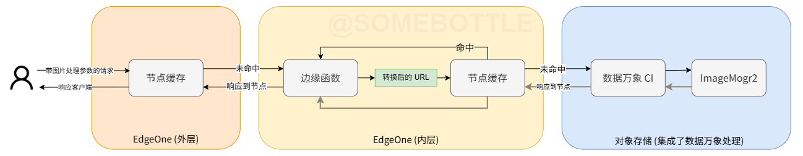  
> 这样甚至有些多级缓存架构的意思了。 


<!-- 示意图 -->

## 3. 解决问题

### 3.1. 配置内层 EdgeOne 服务

首先先在数据万象 (CI) [控制台](https://console.cloud.tencent.com/ci)开通服务，然后绑定博客图像资源的存储桶。如果之前没有开通过 CI，可能暂时没有免费资源包，开始使用后会自动发放。  

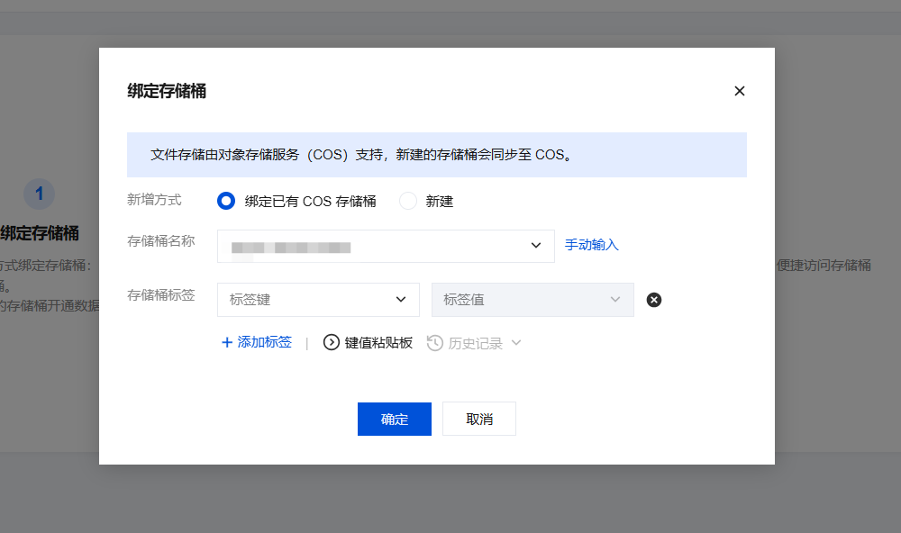  
> 绑定存储桶  

在 EdgeOne 控制台给站点新增一个域名，源站设定为存储桶，准备作为内层 EdgeOne 服务。  

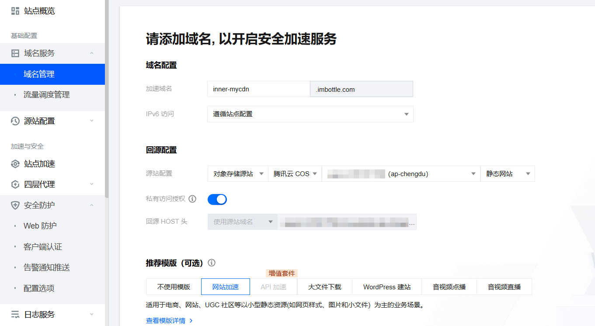  
> 新增域名

在规则引擎新增针对这个内层服务域名的规则。为了防止其他人直接通过内层域名访问服务，我添加了规则来**要求请求必须通过 `X-Upstream-Token` 头部传递一个预设的 token**，否则返回 403。保险起见这里我还显式指明不缓存 403 响应，虽然[默认情况下 403 是不缓存](https://cloud.tencent.com/document/product/1552/87651)的。  

* 在官方*请求处理顺序*文档中能看到，规则引擎处理在边缘函数执行之前，因此规则若直接应答 403 是不会触发边缘函数的。

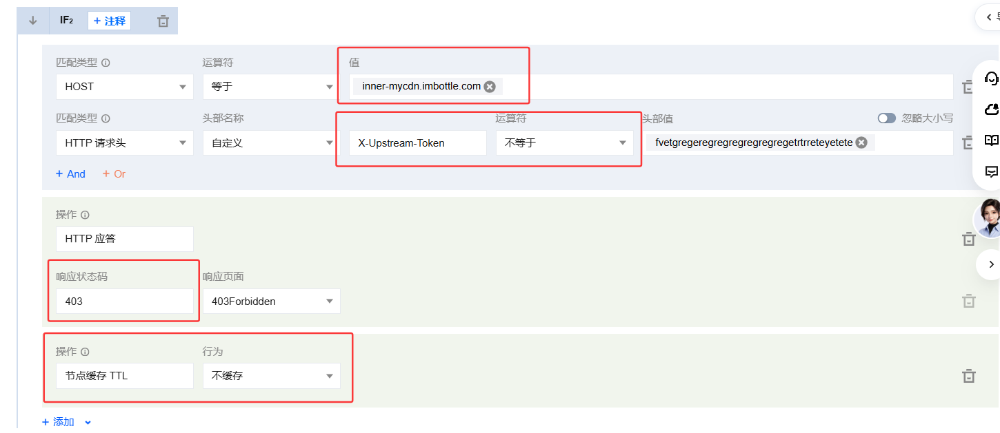  


接下来编写边缘函数并设定触发条件。边缘函数编写可以直接用腾讯云自带的边缘函数 AI 助手，也可以用其他 Coding 能力强的模型和 Agent 来编写。  

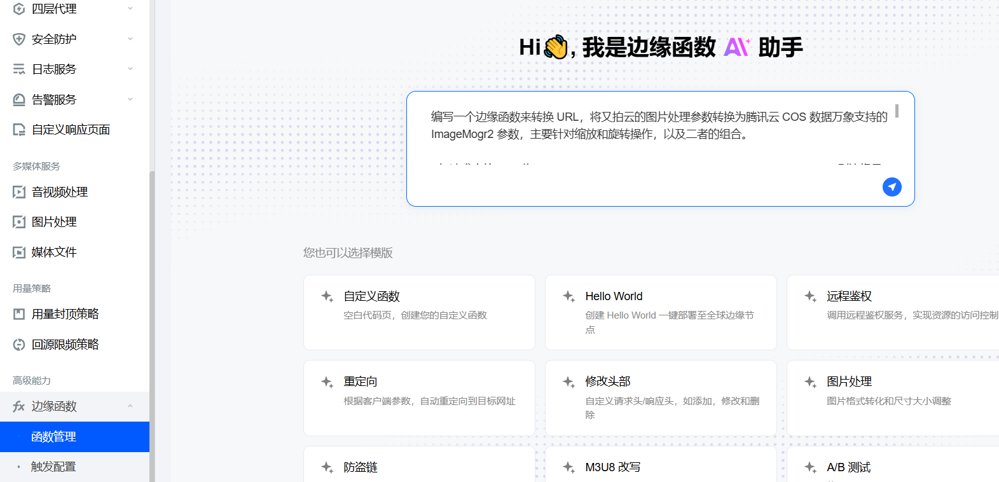  

个人编写的提示词如下:  

```markdown
编写一个边缘函数来转换 URL，将又拍云的图片处理参数转换为腾讯云 COS 数据万象支持的 ImageMogr2 参数，主要针对缩放和旋转操作，以及二者的组合。  

scale 限制在 100 以内，离散化，只能有 5, 10, 15, ... 这样 5 的倍数，中间值自动 round 取整到最近的 5 的倍数；rotate 则只能是 45 的倍数或者 10 的倍数，或者 auto。

组合时，最多只能组合一个 scale 加一个 rotate。

* 如请求中的 URL 为 `https://example.com/path/to/image.jpg!/scale/50/rotate/90`，则边缘函数应将其转换为 `https://example.com/path/to/image.jpg?imageMogr2/thumbnail/!50p/rotate/90`，**保持处理顺序**。

* 又如请求中的 URL 为 `https://example.com/path/to/image.jpg!/scale/30`，则边缘函数应将其转换为 `https://example.com/path/to/image.jpg?imageMogr2/thumbnail/!30p`。

* 也有自适应旋转的情况，如请求中的 URL 为 `https://example.com/path/to/image.jpg!/rotate/auto`，则边缘函数应将其转换为 `https://example.com/path/to/image.jpg?imageMogr2/auto-orient`。

URL 转换后再继续后续的缓存命中和回源等流程。  
```

<details>

<summary>ChatGPT 调整后的边缘函数代码</summary>  

```javascript
/**
 * Tencent Cloud EdgeOne Edge Function
 *
 * 功能：
 * 将又拍云风格的图片处理参数转换为腾讯云 COS 数据万象 ImageMogr2 参数。
 *
 * 当前支持：
 *
 *   !/scale/50
 *     ->
 *   ?imageMogr2/thumbnail/!50p
 *
 *   !/rotate/90
 *     ->
 *   ?imageMogr2/rotate/90
 *
 *   !/rotate/auto
 *     ->
 *   ?imageMogr2/auto-orient
 *
 *   !/scale/52
 *     ->
 *   ?imageMogr2/thumbnail/!50p
 *
 *   !/scale/53/rotate/90
 *     ->
 *   ?imageMogr2/thumbnail/!55p/rotate/90
 *
 * 设计原则：
 * - 仅允许 GET / HEAD
 * - 不接受客户端 Query String
 * - 仅支持 scale 和 rotate
 * - scale 输入范围：1 - 100
 * - scale 自动 round 到最近的 5 的倍数
 * - scale 最终结果只会是：5, 10, 15, ... 100
 * - rotate 允许 auto
 * - rotate 数字范围：1 - 360
 * - rotate 数字必须为 45 的倍数或 10 的倍数
 * - 最多只允许一个 scale 和一个 rotate
 * - 不支持的参数直接返回 404
 * - 不重定向客户端，只在边缘节点内部改写请求
 */

addEventListener('fetch', event => {
  event.respondWith(handleRequest(event.request));
});


async function handleRequest(request) {
  try {

    // ------------------------------------------------------------
    // 1. 仅允许 GET / HEAD
    // ------------------------------------------------------------

    if (
      request.method !== 'GET' &&
      request.method !== 'HEAD'
    ) {
      return new Response(
        'Method Not Allowed',
        {
          status: 405,
          headers: {
            'Allow': 'GET, HEAD',
            'Content-Type':
              'text/plain; charset=utf-8',
            'Cache-Control':
              'no-store'
          }
        }
      );
    }


    // ------------------------------------------------------------
    // 2. 解析请求 URL
    // ------------------------------------------------------------

    const url = new URL(request.url);

    const marker = '!/';


    // ------------------------------------------------------------
    // 3. 不允许客户端携带任何 Query String
    //
    // 例如：
    //
    // /image.jpg?imageMogr2/...
    // /image.jpg?ci-process=...
    // /image.jpg?foo=bar
    //
    // 全部直接拒绝。
    //
    // 这一层建议同时在 EdgeOne 规则引擎中配置，
    // 这里再做一次 defense in depth。
    // ------------------------------------------------------------

    if (url.search) {
      return new Response(
        'Forbidden',
        {
          status: 403,
          headers: {
            'Content-Type':
              'text/plain; charset=utf-8',
            'Cache-Control':
              'no-store'
          }
        }
      );
    }


    // ------------------------------------------------------------
    // 4. 查找又拍云风格处理标记
    // ------------------------------------------------------------

    const markerIndex =
      url.pathname.indexOf(marker);


    // 没有图片处理参数，普通图片直接放行
    if (markerIndex === -1) {
      return fetch(request);
    }


    // ------------------------------------------------------------
    // 5. 防止出现多个 !/
    //
    // 例如：
    //
    // /image.jpg!/scale/50!/rotate/90
    //
    // 直接视为非法请求。
    // ------------------------------------------------------------

    if (
      url.pathname.indexOf(
        marker,
        markerIndex + marker.length
      ) !== -1
    ) {
      return rejectInvalidProcessing();
    }


    // ------------------------------------------------------------
    // 6. 分离原始图片路径和处理参数
    //
    // 输入：
    //
    // /path/image.jpg!/scale/50/rotate/90
    //
    // imagePath:
    //
    // /path/image.jpg
    //
    // processingString:
    //
    // scale/50/rotate/90
    // ------------------------------------------------------------

    const imagePath =
      url.pathname.slice(
        0,
        markerIndex
      );

    const processingString =
      url.pathname.slice(
        markerIndex + marker.length
      );


    if (
      !imagePath ||
      !processingString
    ) {
      return rejectInvalidProcessing();
    }


    // ------------------------------------------------------------
    // 7. 严格拆分参数
    //
    // 不使用 filter(Boolean)。
    //
    // 防止：
    //
    // scale//50
    //
    // 被错误理解为：
    //
    // scale/50
    // ------------------------------------------------------------

    const params =
      processingString.split('/');


    if (
      params.length === 0 ||
      params.some(
        param => param.length === 0
      )
    ) {
      return rejectInvalidProcessing();
    }


    // ------------------------------------------------------------
    // 8. 转换成 ImageMogr2 参数
    // ------------------------------------------------------------

    const convertedParams =
      convertToImageMogr2(params);


    if (convertedParams === null) {
      return rejectInvalidProcessing();
    }


    // ------------------------------------------------------------
    // 9. 构造 COS ImageMogr2 参数
    // ------------------------------------------------------------

    const imageMogr2 =
      `imageMogr2/${convertedParams.join('/')}`;


    // ------------------------------------------------------------
    // 10. 构造内部 URL
    //
    // 原：
    //
    // /image.jpg!/scale/53/rotate/90
    //
    // 内部：
    //
    // /image.jpg?imageMogr2/thumbnail/!55p/rotate/90
    // ------------------------------------------------------------

    const newUrl =
      new URL(request.url);

    newUrl.pathname =
      imagePath;

    newUrl.search =
      `?${imageMogr2}`;


    // ------------------------------------------------------------
    // 11. 构造内部请求
    //
    // Host 保持不变。
    //
    // 同 Host fetch：
    //
    // Edge Function
    //      ↓
    // EdgeOne Cache
    //      ↓ MISS
    // COS Origin
    // ------------------------------------------------------------

    const headers =
      new Headers(
        request.headers
      );


    const upstreamRequest =
      new Request(
        newUrl.toString(),
        {
          method:
            request.method,

          headers,

          redirect:
            'manual'
        }
      );


    // ------------------------------------------------------------
    // 12. 请求转换后的 URL
    // ------------------------------------------------------------

    return await fetch(
      upstreamRequest
    );

  } catch (error) {

    // ------------------------------------------------------------
    // 不向客户端返回内部错误信息。
    // ------------------------------------------------------------

    console.error(
      'Upyun -> COS ImageMogr2 conversion failed:',
      error
    );


    return new Response(
      'Internal Server Error',
      {
        status: 500,
        headers: {
          'Content-Type':
            'text/plain; charset=utf-8',

          'Cache-Control':
            'no-store'
        }
      }
    );
  }
}


/**
 * 将又拍云参数转换为 COS ImageMogr2 参数。
 *
 * 允许：
 *
 * !/scale/50
 *
 * !/rotate/90
 *
 * !/rotate/auto
 *
 * !/scale/50/rotate/90
 *
 * !/rotate/90/scale/50
 *
 *
 * 不允许：
 *
 * !/scale/50/scale/60
 *
 * !/rotate/90/rotate/180
 *
 * !/scale/50/rotate/90/scale/60
 *
 * !/crop/100
 *
 * !/scale/50/crop/100
 */
function convertToImageMogr2(params) {

  // ------------------------------------------------------------
  // 只接受：
  //
  // [operation, value]
  //
  // 或：
  //
  // [operation1, value1, operation2, value2]
  // ------------------------------------------------------------

  if (
    params.length !== 2 &&
    params.length !== 4
  ) {
    return null;
  }


  const operations = [];

  const seenOperations =
    new Set();


  // ------------------------------------------------------------
  // 解析 operation / value 对
  // ------------------------------------------------------------

  for (
    let i = 0;
    i < params.length;
    i += 2
  ) {

    const operation =
      params[i];

    const value =
      params[i + 1];


    // 只支持 scale / rotate

    if (
      operation !== 'scale' &&
      operation !== 'rotate'
    ) {
      return null;
    }


    // ----------------------------------------------------------
    // 最多只能有：
    //
    // 一个 scale
    // +
    // 一个 rotate
    //
    // 防止：
    //
    // scale/50/scale/60
    //
    // rotate/90/rotate/180
    // ----------------------------------------------------------

    if (
      seenOperations.has(
        operation
      )
    ) {
      return null;
    }


    seenOperations.add(
      operation
    );


    operations.push({
      operation,
      value
    });
  }


  // ------------------------------------------------------------
  // 转换
  // ------------------------------------------------------------

  const result = [];


  for (
    const item of operations
  ) {

    // ==========================================================
    // SCALE
    // ==========================================================

    if (
      item.operation === 'scale'
    ) {

      const scale =
        parseAndNormalizeScale(
          item.value
        );


      if (scale === null) {
        return null;
      }


      result.push(
        `thumbnail/!${scale}p`
      );


      continue;
    }


    // ==========================================================
    // ROTATE
    // ==========================================================

    if (
      item.operation === 'rotate'
    ) {

      const rotate =
        parseAndNormalizeRotate(
          item.value
        );


      if (rotate === null) {
        return null;
      }


      if (
        rotate === 'auto'
      ) {

        result.push(
          'auto-orient'
        );

      } else {

        result.push(
          `rotate/${rotate}`
        );
      }


      continue;
    }


    return null;
  }


  // 理论上的额外保险

  if (
    result.length === 0 ||
    result.length > 2
  ) {
    return null;
  }


  return result;
}


/**
 * 解析并规范化 scale。
 *
 * 规则：
 *
 * 1. 必须是纯数字整数
 *
 * 2. 输入范围：
 *
 *    1 - 100
 *
 * 3. 自动 round 到最近的 5 的倍数
 *
 * 4. 最终结果：
 *
 *    5, 10, 15, 20, ... 100
 *
 *
 * 示例：
 *
 * "1"   -> "5"
 *
 * "2"   -> "5"
 *
 * "3"   -> "5"
 *
 * "5"   -> "5"
 *
 * "7"   -> "5"
 *
 * "8"   -> "10"
 *
 * "12"  -> "10"
 *
 * "13"  -> "15"
 *
 * "52"  -> "50"
 *
 * "53"  -> "55"
 *
 * "97"  -> "95"
 *
 * "98"  -> "100"
 *
 * "99"  -> "100"
 *
 * "100" -> "100"
 */
function parseAndNormalizeScale(
  value
) {

  const number =
    parseStrictInteger(
      value
    );


  if (number === null) {
    return null;
  }


  // 输入值严格限制在 1 - 100

  if (
    number < 1 ||
    number > 100
  ) {
    return null;
  }


  // ------------------------------------------------------------
  // Round 到最近的 5 的倍数
  //
  // 例如：
  //
  // 52 / 5 = 10.4
  // Math.round = 10
  // 10 * 5 = 50
  //
  // 53 / 5 = 10.6
  // Math.round = 11
  // 11 * 5 = 55
  // ------------------------------------------------------------

  let rounded =
    Math.round(
      number / 5
    ) * 5;


  // 下限保护

  if (rounded < 5) {
    rounded = 5;
  }


  // 上限保护

  if (rounded > 100) {
    rounded = 100;
  }


  return String(
    rounded
  );
}


/**
 * 解析 rotate。
 *
 * 规则：
 *
 * 1. "auto" 合法
 *
 * 2. 数字必须为：
 *
 *    1 - 360
 *
 * 3. 且满足以下至少一个条件：
 *
 *    - 45 的倍数
 *
 *    或
 *
 *    - 10 的倍数
 *
 *
 * 合法示例：
 *
 * auto
 *
 * 10
 * 20
 * 30
 * 40
 * 45
 * 50
 * 60
 * 70
 * 80
 * 90
 * 100
 * 110
 * 120
 * 130
 * 135
 * 140
 * ...
 * 180
 * ...
 * 270
 * ...
 * 360
 *
 *
 * 非法示例：
 *
 * 1
 * 5
 * 11
 * 44
 * 46
 * 91
 * 359
 */
function parseAndNormalizeRotate(
  value
) {

  // 自动 EXIF 方向纠正

  if (
    value === 'auto'
  ) {
    return 'auto';
  }


  const number =
    parseStrictInteger(
      value
    );


  if (number === null) {
    return null;
  }


  // 限制角度范围

  if (
    number < 1 ||
    number > 360
  ) {
    return null;
  }


  // ------------------------------------------------------------
  // 必须满足：
  //
  // 45 的倍数
  //
  // 或
  //
  // 10 的倍数
  // ------------------------------------------------------------

  if (
    number % 45 !== 0 &&
    number % 10 !== 0
  ) {
    return null;
  }


  return String(
    number
  );
}


/**
 * 严格解析整数。
 *
 * 只接受：
 *
 * 0-9
 *
 * 不接受：
 *
 * +50
 * -50
 * 50.0
 * 5e1
 *  50
 * 50%
 *
 *
 * 前导 0 会被规范化：
 *
 * "050" -> 50
 */
function parseStrictInteger(
  value
) {

  if (
    !/^\d+$/.test(
      value
    )
  ) {
    return null;
  }


  const number =
    Number(value);


  if (
    !Number.isSafeInteger(
      number
    )
  ) {
    return null;
  }


  return number;
}


/**
 * 非法图片处理参数统一在边缘返回 404。
 *
 * 不再将非法 !/ 请求回源，
 * 避免攻击者构造大量垃圾 URL 打 COS。
 */
function rejectInvalidProcessing() {

  return new Response(
    'Not Found',
    {
      status: 404,
      headers: {
        'Content-Type':
          'text/plain; charset=utf-8',

        'Cache-Control':
          'no-store'
      }
    }
  );
}
```

</details>

部署函数后还得写写触发规则，这里可以写得比较简单，URL full 正则匹配 `^.*!/.+$` 即触发:  

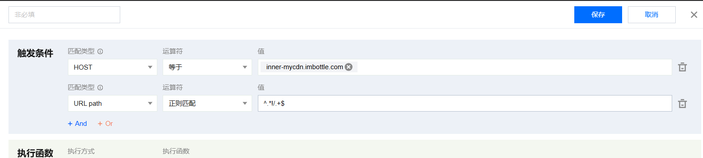  

至此内层服务的核心部分就配置完成了，其他还有节点缓存 TTL 之类的可以按个人喜好配置。

### 3.2. 配置外层 EdgeOne 服务

首先依旧是新增域名，注意这里源站和回源 HOST 都指向内层 EdgeOne 服务的域名。回源协议其实 HTTP 和 HTTPS 都可以，前者更快，后者更安全:      

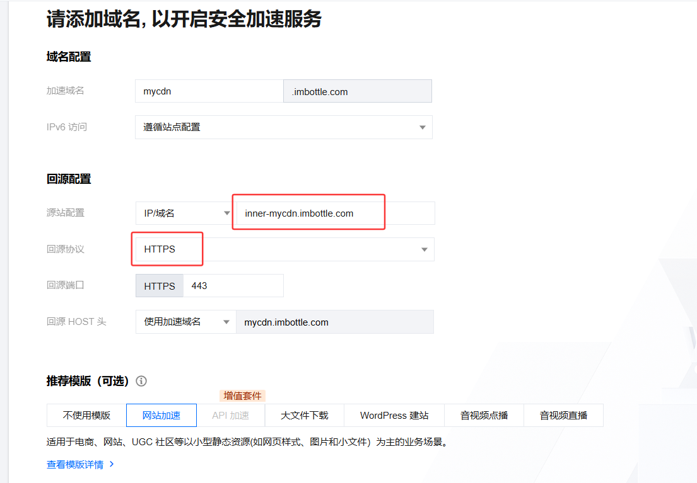  

接着同样是在规则引擎，我们需要新增回源请求头，**新增内层服务所需的 `X-Upstream-Token` 头并设置相应的值**以确保能正常回源:  

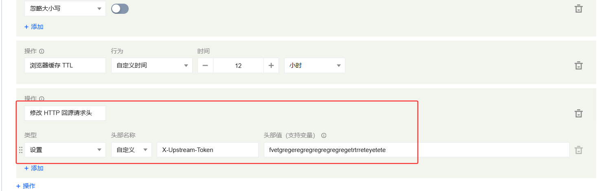  

注意，因为请求参数是会透传到底层 COS 和 CI 服务的，可以通过请求参数调用数据万象服务进行千奇百怪的处理，所以恶意攻击者就能构造不同的处理参数来通过数据万象服务耗尽免费额度甚至消耗账户余额。因此咱建议可以在自定义 Cache Key 这里**忽略查询字符串**，也可以新增一个子条件判断，**阻止查询字符串**（毕竟我们只用得上 `!/` 风格的处理参数）:  

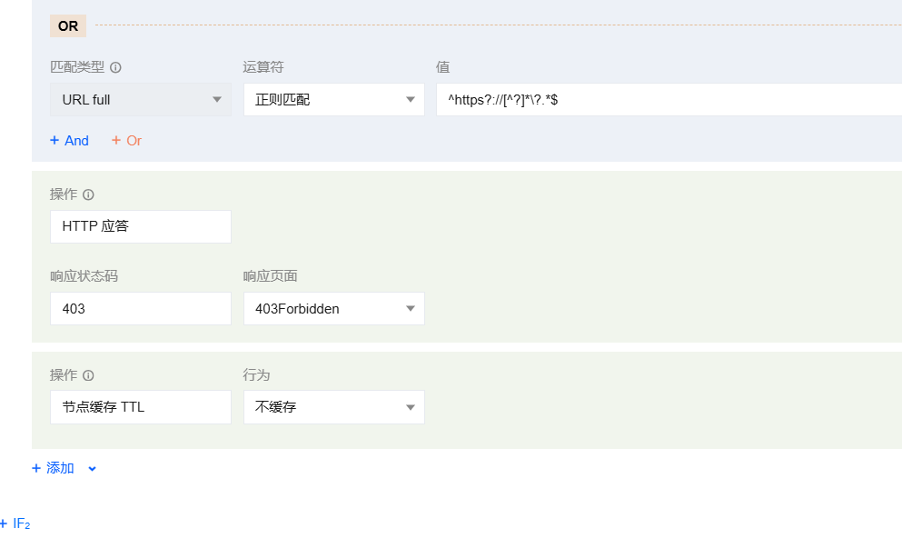  

其余节点缓存 TTL、浏览器缓存、请求头判断等规则亦可按喜好进行配置。  

至此，由内外两层套娃而成、且兼容又拍云风格处理参数的图片资源服务就部署完成了 ٩(ˊᗜˋ*)و。  